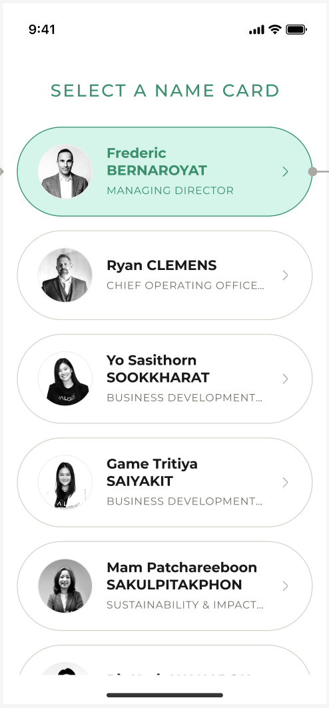

# [DNC-001] Contact List Display Screen

| **Priority** | **Story Points** |
| ------------ | ---------------- |
| High 🔴      | 8                |

## Description

As a user, I want to view and select from a list of business cards so that I can quickly access and share specific contact information.

## Design

## Acceptance Criteria

| Given                                  | When                            | Then                                                                                                                     |
| -------------------------------------- | ------------------------------- | ------------------------------------------------------------------------------------------------------------------------ |
| **List Display & Sorting**             |
| I am on the name card selection screen | The screen loads                | I should see a list of business cards with profile pictures, names, and job titles                                       |
| I am viewing the contact list          | The list first loads            | Contacts should be sorted with Managing Director first, followed by COO, then Business Development Managers, then others |
| I am viewing the contact list          | There are no contacts           | I should see an appropriate empty state message                                                                          |
| **Loading & Performance**              |
| I am viewing the contact list          | The internet connection is slow | I should see a loading indicator while content loads                                                                     |
| I have multiple contacts in my list    | I scroll through the list       | The list should scroll smoothly and load more contacts as I scroll                                                       |
| I scroll to the bottom of the list     | More contacts exist             | Additional contacts should load automatically without a "Load More" button                                               |
| I have many contacts                   | I return to the app later       | The list should load quickly using cached data                                                                           |
| **Card Display**                       |
| A contact has no profile picture       | The card displays               | A default placeholder image should appear                                                                                |
| The contact has a long job title       | The card displays on screen     | The job title should be properly formatted without breaking the layout                                                   |
| **Card Interaction**                   |
| I am viewing the contact list          | I tap on a contact card         | The card should highlight and take me to the contact details                                                             |
| I have selected a contact card         | The card is active              | It should be visually distinguished with a green background                                                              |
| **Accessibility**                      |
| I am using a screen reader             | I navigate through the list     | Each card should be properly announced with all relevant information                                                     |
