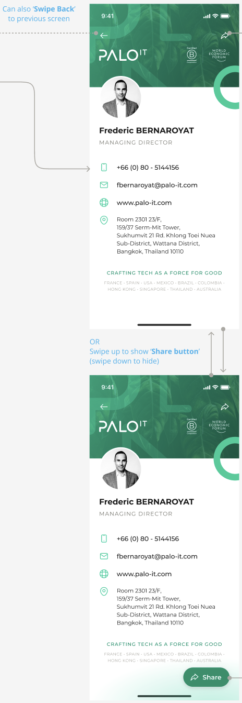

# [DNC-002] Business Card Detail Screen

| **Priority** | **Story Points** |
| ------------ | ---------------- |
| High 🔴      | 8                |

## Description

As a user, I want to view a contact's detailed business card information and have options to interact with their contact details, so that I can easily connect with them through various channels.

## Design

## Acceptance Criteria

| Given                            | When                               | Then                                                                                                                                                  |
| -------------------------------- | ---------------------------------- | ----------------------------------------------------------------------------------------------------------------------------------------------------- |
| **Initial Load & Display**       |
| I tap on a contact from the list | The detail screen loads            | I should see the contact's full business card with profile picture, name, and title                                                                   |
| I am viewing the business card   | The screen loads                   | I should see the PALO.IT branding and logos at the top                                                                                                |
| I am viewing the business card   | The contact has no profile picture | A default placeholder image should appear                                                                                                             |
| **Navigation**                   |
| I am viewing the business card   | I tap the back button              | I should return to the contact list screen                                                                                                            |
| I am viewing the business card   | I swipe right                      | I should return to the contact list screen                                                                                                            |
| **Contact Information Display**  |
| I am viewing the contact details | I look at contact information      | I should see phone, email, website, and address clearly laid out with icons                                                                           |
| I am viewing the contact details | The phone number displays          | It should be in international format (+66 (0) 80-5144156)                                                                                             |
| I am viewing the contact details | The email displays                 | It should be in lowercase format                                                                                                                      |
| I am viewing the contact details | The address is multi-line          | It should follow Room/Floor format, properly aligned with location icon                                                                               |
| **Contact Actions**              |
| I am viewing the contact details | I tap on the phone number          | My device should prompt to initiate a phone call                                                                                                      |
| I am viewing the contact details | I tap on the email address         | My device should open the email client                                                                                                                |
| I am viewing the contact details | I tap on the website               | My device should open the website in a browser                                                                                                        |
| I am viewing the contact details | I tap on the address               | My device should open the maps application                                                                                                            |
| **Company Information**          |
| I am viewing the business card   | I look at the bottom               | I should see the company tagline "CRAFTING TECH AS A FORCE FOR GOOD"                                                                                  |
| I am viewing the business card   | I look below the tagline           | I should see the list of company locations in order: FRANCE - SPAIN - USA - MEXICO - BRAZIL - COLOMBIA - HONG KONG - SINGAPORE - THAILAND - AUSTRALIA |
| **Share Functionality**          |
| I am viewing the business card   | The screen loads                   | I should see a share button at the bottom with slide-up animation                                                                                     |
| I am viewing the business card   | I tap the share button             | I should see a note that sharing will be implemented in another story                                                                                 |
