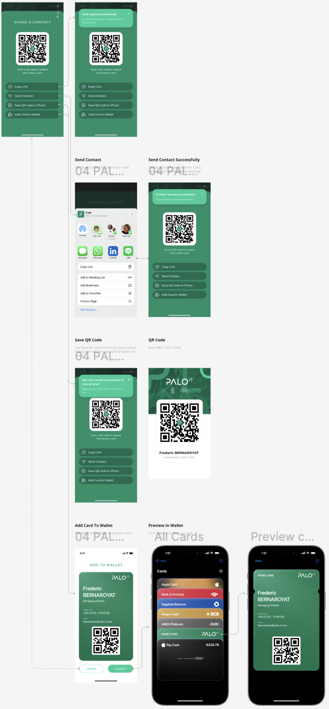

# [DNC-003+] Share Contact Screen

| **Priority** | **Story Points** |
| ------------ | ---------------- |
| High 🔴      | 8                |

## Description

As a user, I want to share a contact's business card through various methods so that I can easily distribute contact information to others.

## Design

## Acceptance Criteria

| Given                           | When                        | Then                                                                          |
| ------------------------------- | --------------------------- | ----------------------------------------------------------------------------- |
| **Modal Display & UI**          |
| I tap the share button          | The share screen appears    | I should see a modal with "SHARE A CONTACT" header                            |
| I am viewing the share modal    | The modal appears           | It should slide up from the bottom with animation                             |
| I am viewing the share modal    | I tap the X button          | The modal should close and return to the business card                        |
| I am viewing the share modal    | I swipe down                | The modal should dismiss and return to business card                          |
| I am viewing the share modal    | I tap outside the modal     | The modal should dismiss and return to business card                          |
| I am viewing the share modal    | The modal appears           | The background should be dimmed                                               |
| I am viewing the share modal    | I look at the buttons       | Each option should have an icon and text with proper spacing                  |
| I am viewing the share options  | I look at the layout        | Options should be stacked vertically with consistent spacing                  |
| **QR Code Display**             |
| I am viewing the share modal    | The screen loads            | I should see a QR code centered in a white container                          |
| I am viewing the QR code        | I look at the QR code       | I should see the PALO.IT logo in the center of the code                       |
| I am viewing the QR code        | I look below the code       | I should see the text "Scan a QR code to receive the contact card"            |
| **Copy Link Function**          |
| I tap "Copy Link"               | The action completes        | I should see a snackbar message "Link copied to clipboard"                    |
| **Send Contact Function**       |
| I tap "Send Contact"            | The option is selected      | The native system share sheet should appear                                   |
| I select a share target         | The share completes         | I should see a snackbar message "Contact shared successfully"                 |
| **Save QR Code Function**       |
| I tap "Save QR code to Photo"   | The action completes        | The QR code should be saved to my photo gallery                               |
| I tap "Save QR code to Photo"   | The save succeeds           | I should see a snackbar message "QR code saved to photos"                     |
| **Wallet Integration**          |
| I am viewing the share options  | No wallet app is available  | The "Add Card to Wallet" option should not be displayed                       |
| I am viewing the share options  | One wallet app is available | Tapping "Add Card to Wallet" should open that wallet directly                 |
| I am viewing the share options  | Multiple wallet apps exist  | Tapping "Add Card to Wallet" should show native action sheet to choose wallet |
| I am viewing the wallet preview | I look at the card          | It should follow the wallet card design as specified in Figma                 |
| I confirm adding to wallet      | The action completes        | I should see a snackbar message "Card added to wallet"                        |
| **System Integration**          |
| I complete any share action     | A snackbar appears          | It should use the system's default snackbar animation and timing              |
| I tap "Send Contact"            | The share sheet opens       | It should use the native iOS/Android share sheet                              |
| I tap "Add Card to Wallet"      | Multiple wallets detected   | It should use the native action sheet for wallet selection                    |
