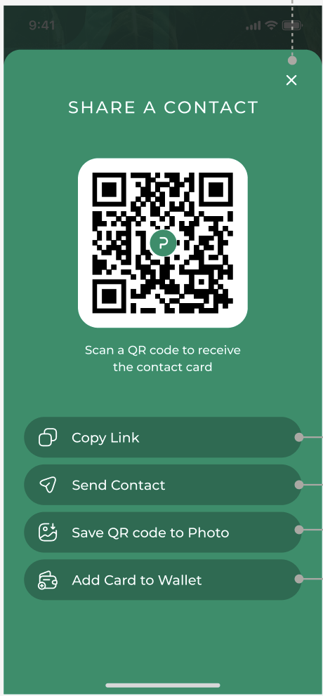

# [DNC-003] Share Contact Screen

| **Priority** | **Story Points** |
| ------------ | ---------------- |
| High 🔴      | 8                |

## Description

As a user, I want to share a contact's business card through various methods so that I can easily distribute contact information to others.

## Design

## Acceptance Criteria

| Given                          | When                     | Then                                                                                       |
| ------------------------------ | ------------------------ | ------------------------------------------------------------------------------------------ |
| **Modal Display**              |
| I tap the share button         | The share screen appears | I should see a modal with "SHARE A CONTACT" header                                         |
| I am viewing the share modal   | The modal appears        | It should slide up from the bottom with animation                                          |
| I am viewing the share modal   | I tap the X button       | The modal should close and return to the business card                                     |
| I am viewing the share modal   | I swipe down             | The modal should dismiss and return to business card                                       |
| I am viewing the share modal   | I tap outside the modal  | The modal should dismiss and return to business card                                       |
| I am viewing the share modal   | The modal appears        | The background should be dimmed                                                            |
| **QR Code**                    |
| I am viewing the share modal   | The screen loads         | I should see a QR code centered in a white container                                       |
| I am viewing the QR code       | I look at the QR code    | I should see the PALO.IT logo in the center of the code                                    |
| I am viewing the QR code       | I look below the code    | I should see the text "Scan a QR code to receive the contact card"                         |
| **Share Options**              |
| I am viewing the share modal   | The screen loads         | I should see four sharing options with icons                                               |
| I am viewing the share options | I look at the options    | They should be ordered: Copy Link, Send Contact, Save QR code to Photo, Add Card to Wallet |
| I tap any sharing option       | The option is selected   | I should see a note that the action will be implemented in a separate user story           |
| **Visual Design**              |
| I am viewing the share modal   | The modal displays       | It should have a green background matching the brand color                                 |
| I am viewing the share options | I look at the buttons    | Each option should have an icon and text with proper spacing                               |
| I am viewing the share options | I look at the layout     | Options should be stacked vertically with consistent spacing                               |
